Die IWM Versuchsumgebung bietet Wissenschaftlern ein einfach konfigurierbares Tool mit vielen vorgefretigten Fragetypen. Komplexere Fragetypen, die in anderen Anwendungen nicht realisiert werden können, können hier unter Zusammenarbeit mit der Medienentwicklung implementiert werden. Dadurch entsteht ein bewährtes, ständig gepflegtes und weiterentwickeltes Softwaresystem, mit In-Haus Expertise und kurzen Kommunikationswegen.

# Grundlagen

Material wird im HTML-Format erstellt und weißt einige Pflichtelemente auf. Es wird im Ordner content abgelegt, ebenso zugehörige Bilder. Ein guter Ansatz für die Erstellung ist es, eine ähnliche bereits bestehende Datei zu kopieren und zu bearbeiten. Im Folgenden werden die Grundelemente gezeigt, die in jeder HTML-Datei vorkommen sollten. Sie dienen dazu, die Versuchsumgebung in die Seite zu integrieren und damit den Funktionsumfang der Versuchsumgebung (Logging, Ablaufsteuerung, Funktionsaufrufe etc.) verfügbar zu machen, sowie die für das konfigurierbare Layout vorgesehenen Elemente (iwmstudy_masterbox, iwmstudy_contentbox,..) bereitzustellen.

Um Benutzereingaben zu speichern, können verschiedene Eingabeelemente genutzt werden. Die Versuchsumgebung analysiert alle Elemente einer Seite und speichert die Eingaben beim Seitenwechsel, wenn das Element zu den unterstützten Typen gehört und als „id" einen Wert aufweist, der mit „store_" beginnt. Alle Elemente, die so ausgezeichnet sind, sind vom Probanden obligatorisch auszufüllen, damit zur nächsten Seite weitergeschaltet werden kann. Handelt es sich um ein optionales Eingabefeld, ist stattdessen der Wert „storeopt_" am Anfang der „id" anzugeben. Eine Besonderheit stellen Radiobuttons dar. Hier wird „store_" bzw. „storeopt_" nicht als „id" sondern als „name" verwendet. Anonymes Logging ist mit „storeanonym_" und „storeoptanonym_" möglich.

# Fragetypen

## Standard

<!-- C -->

<a class="preview" target="_blank" href="../../studies/demo01/content/material_fragen_checkbox.html">
  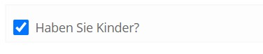
  Checkbox
</a>

<!-- D -->

<a class="preview" target="_blank" href="../../studies/demo01/content/material_fragen_dropdown.html">
  
  Dropdown
</a>

<!-- E -->
  <a class="preview" target="_blank" href="../../studies/demo01/content/material_fragen_einzelauswahl.html">
  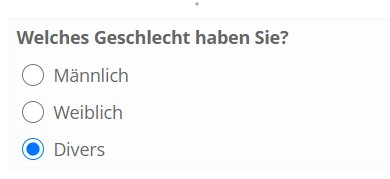
  Einzelauswahl
</a>

<!-- F -->

<a class="preview" target="_blank" href="../../studies/demo01/content/material_fragen_freitext_einzeilig.html">
  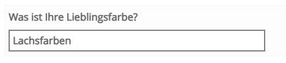
  Freitext (einzeilig)
</a>

<a class="preview" target="_blank" href="../../studies/demo01/content/material_fragen_freitext_mehrzeilig.html">
  
  Freitext (mehrzeilig)
</a>

<!-- M -->

<a class="preview" target="_blank" href="../../studies/demo01/content/material_fragen_mehrfachauswahl.html">
  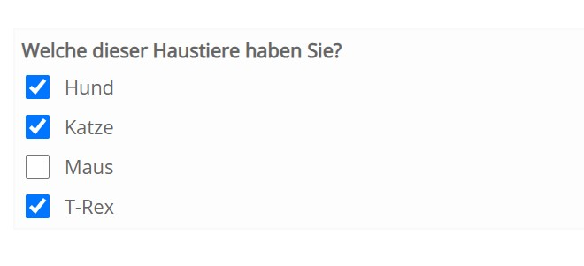
  Mehrfachauswahl
</a>

<a class="preview" target="_blank" href="../../studies/demo01/content/material_fragen_multiskala.html">
  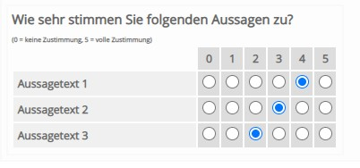
  Multiskala
</a>

<!-- S -->

<a class="preview" target="_blank" href="../../studies/demo01/content/material_fragen_skala.html">
  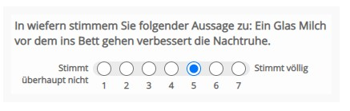
  Skala
</a>

<a class="preview" target="_blank" href="../../studies/demo01/content/material_fragen_slider.html">
  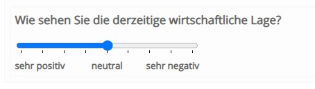
  Slider
</a>

## Drag and Drop

<a class="preview" target="_blank" href="../../studies/demo01/content/material_fragen_dnd_match.html">
  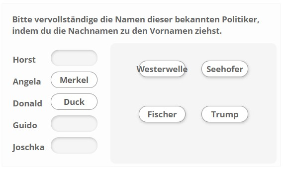
  Zuordnen 
</a>

<a class="preview" target="_blank" href="../../studies/demo01/content/material_fragen_dnd_match_sort.html">
  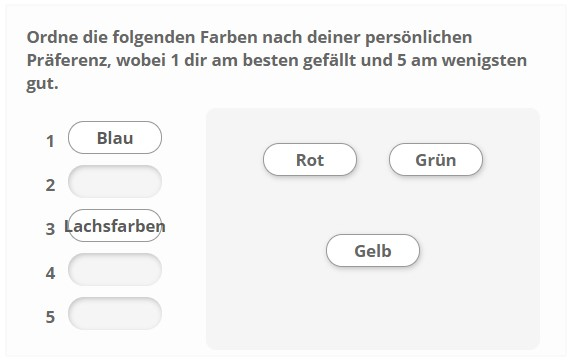
  Sortieren 
</a>

<a class="preview" target="_blank" href="../../studies/demo01/content/material_fragen_dnd_image.html">
  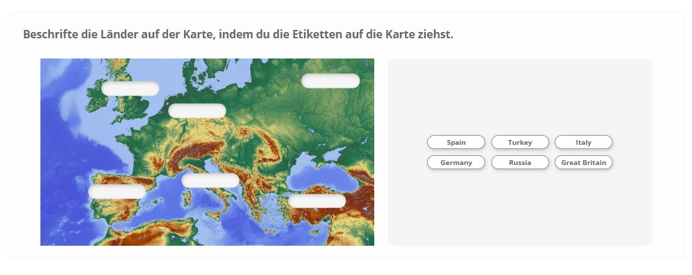
  Bild 
</a>

<a class="preview" target="_blank" href="../../studies/demo01/content/material_fragen_dnd_cloze.html">
  
  Lückentext 
</a>

## Drag and Drop mit Bildern

<a class="preview" target="_blank" href="../../studies/demo01/content/material_fragen_dnd_image_list.html">
  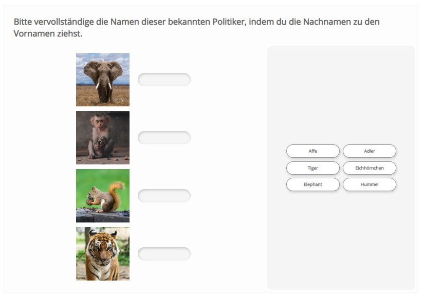
  Zuordnung Bildliste 
</a>

<a class="preview" target="_blank" href="../../studies/demo01/content/material_fragen_dnd_image_image_list.html">
  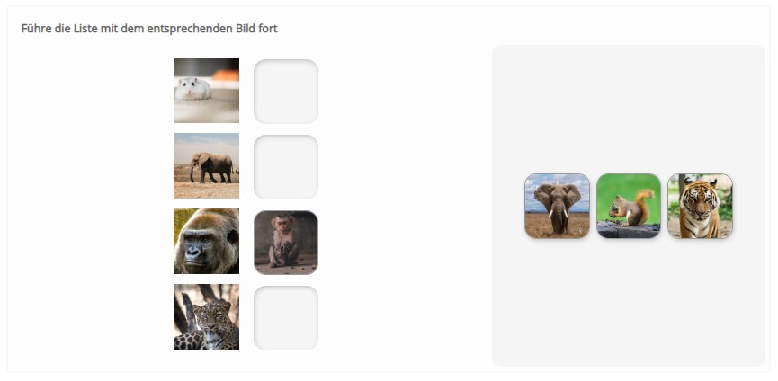
  Bild zu Bild Zuordnung 
</a>

<a class="preview" target="_blank" href="../../studies/demo01/content/material_fragen_dnd_multimage_list.html">
  
  Bilderreihenfolge 
</a>

## Select

  <a class="preview" target="_blank" href="../../studies/demo01/content/material_fragen_select_cloze.html">
    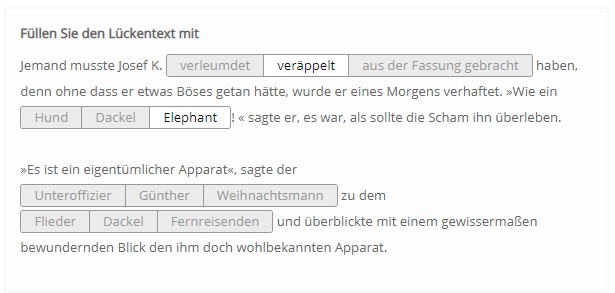
    Lückentext 
  </a>

